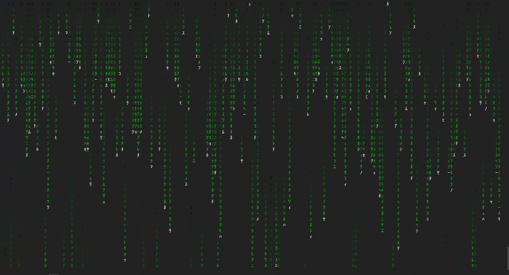

# Rusty Rain

[](LICENSE)


A cross platform matrix rain terminal program that runs well and looks good.


## To Use

Simply run the following command on windows/mac/linux:

```
git clone https://github.com/cowboy8625/RustyRain.git
cd RustyRain
```
```
cargo run --release
```

or to install:

```
 cargo install --path .
```

## Command Line Arguments

```
A terminal program the makes all your friends think you are a hacker.

USAGE:
    rusty_rain.exe [OPTIONS]

FLAGS:
    -h, --help       Prints help information
    -V, --version    Prints version information

OPTIONS:
    -b, --blue <blue>           set color of characters BLUE value
    -c, --chars <characters>    Set what kind of characters are printed as rain
    -g, --green <green>         Set color of characters GREEN value
    -r, --red <red>             Set color of characters RED value
    -s, --shade <shade>         Set Rain shading to fade or stay constant
```

### Example

using cargo to run:

`cargo run --release -- -r 0 -g 139 -b 139 -s 1 -c jap`

after installing:

`rusty_rain -r 0 -g 139 -b 139 -s 1 -c jap`

## Known Bugs

Yeah so there are some pretty bad bug.
On Mac and Windows Rusty Rain doesnt run smoothly at all.
But I am working on it.
If you know how to fix this please dont hesitate to send a pull request.

